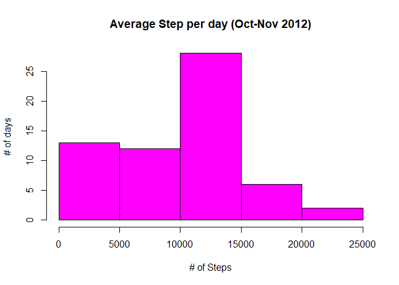
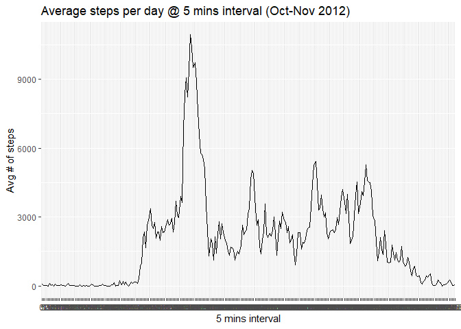
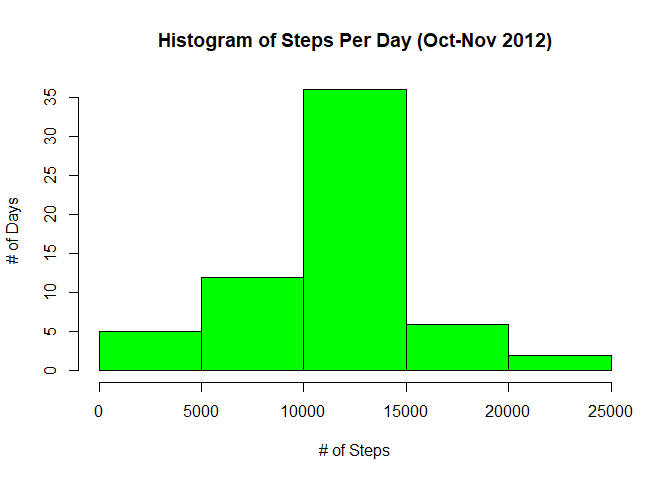
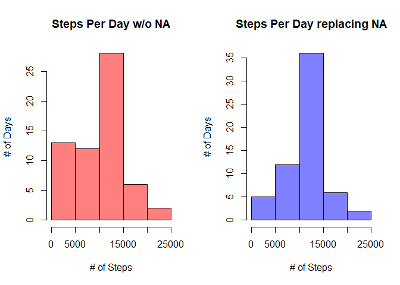
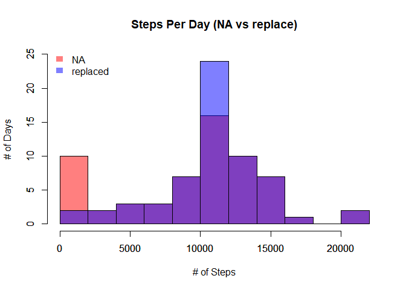
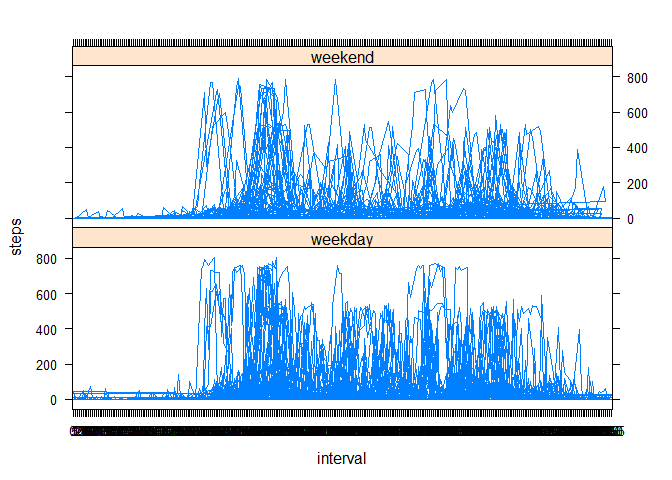

### getting data from the web

    if (!file.exists("./actmdata.csv")) {
      dir.create("./actmdata.csv")
    }
    fileurl <-
      "https://d396qusza40orc.cloudfront.net/repdata%2Fdata%2Factivity.zip"
    download.file(fileurl, destfile = "activity.zip", method = "curl")
    unzip("./activity.zip")
    library(dplyr)

    ## Warning: package 'dplyr' was built under R version 3.6.1

    ## 
    ## Attaching package: 'dplyr'

    ## The following objects are masked from 'package:stats':
    ## 
    ##     filter, lag

    ## The following objects are masked from 'package:base':
    ## 
    ##     intersect, setdiff, setequal, union

    dt <- read.csv("activity.csv")

### cleaning data

    dt$date <- as.Date(dt$date)
    dt$interval <- as.factor(dt$interval)
    str(dt)

    ## 'data.frame':    17568 obs. of  3 variables:
    ##  $ steps   : int  NA NA NA NA NA NA NA NA NA NA ...
    ##  $ date    : Date, format: "2012-10-01" "2012-10-01" ...
    ##  $ interval: Factor w/ 288 levels "0","5","10","15",..: 1 2 3 4 5 6 7 8 9 10 ...

### calculating mean of steps by day

    library(plyr)

    ## -------------------------------------------------------------------------

    ## You have loaded plyr after dplyr - this is likely to cause problems.
    ## If you need functions from both plyr and dplyr, please load plyr first, then dplyr:
    ## library(plyr); library(dplyr)

    ## -------------------------------------------------------------------------

    ## 
    ## Attaching package: 'plyr'

    ## The following objects are masked from 'package:dplyr':
    ## 
    ##     arrange, count, desc, failwith, id, mutate, rename, summarise,
    ##     summarize

    step_day <-
      ddply(dt, .(date), summarise, sum = sum(steps, na.rm = TRUE))
    hist(
      step_day$sum,
      ylab = "# of days",
      xlab = "# of Steps",
      col = "magenta",
      main = "Average Step per day (Oct-Nov 2012)"
    )

### calculatong mean & median of steps taken per day

    mean(step_day$sum)

    ## [1] 9354.23

    median(step_day$sum)

    ## [1] 10395

### calculating & plotting average daily activity pattern

    step_interval_daily <-
      ddply(dt, .(interval), summarise, sum = sum(steps, na.rm = TRUE))

    library(ggplot2)

    ## Warning: package 'ggplot2' was built under R version 3.6.1

    fig <-
      ggplot(step_interval_daily, aes(x = interval, y = sum, group = "1"))
    fig + geom_line() + labs(title = "Average steps per day @ 5 mins interval (Oct-Nov 2012)") + labs(x = "5 mins interval", y = "Avg # of steps")

### calculating max daily step

    step_interval_daily [which(step_interval_daily$sum == max(sum(step_interval_daily$sum))),]

    ## [1] interval sum     
    ## <0 rows> (or 0-length row.names)

### inputting missing values

    missing_values <- dt[!complete.cases(dt),]
    nrow(missing_values)

    ## [1] 2304

    interval_mean <-
      ddply(dt, .(interval), summarise, mean = mean(steps, na.rm = TRUE))

    new_dt <- join(dt, interval_mean)

    ## Joining by: interval

    replace_NA <- function(dataset, variable, replacement) {
      for (i in 1:nrow(dataset)) {
        if (is.na(dataset[i, variable])) {
          dataset[i, variable] <- dataset[i, replacement]
        }
      }
      dataset
    }

    complete_dt <- replace_NA(new_dt, variable = 1, replacement = 4)

    complete_dt <- complete_dt[,-4]
    head(complete_dt)

    ##       steps       date interval
    ## 1 1.7169811 2012-10-01        0
    ## 2 0.3396226 2012-10-01        5
    ## 3 0.1320755 2012-10-01       10
    ## 4 0.1509434 2012-10-01       15
    ## 5 0.0754717 2012-10-01       20
    ## 6 2.0943396 2012-10-01       25

### making histogram for all steps taken

    all_steps_per_day <-
      ddply(complete_dt, .(date), summarise, sum = sum(steps))
    all_steps_per_day$sum <- round(all_steps_per_day$sum)
    hist(
      all_steps_per_day$sum,
      ylab = "# of Days",
      col = "green",
      xlab = "# of Steps",
      main = "Histogram of Steps Per Day (Oct-Nov 2012)"
    )

### comparing mean & median

    mean(step_day$sum)

    ## [1] 9354.23

    mean(all_steps_per_day$sum)

    ## [1] 10766.16

    median(step_day$sum)

    ## [1] 10395

    median(all_steps_per_day$sum)

    ## [1] 10766

### making seperate hist to show the impact of replacing missing value

    par(mfrow=c(1,2)) 
    hist(step_day$sum, ylab="# of Days", col=rgb(1,0,0,0.5), xlab="# of Steps", main="Steps Per Day w/o NA")
    hist(all_steps_per_day$sum, ylab="# of Days", col=rgb(0,0,1,0.5), xlab="# of Steps", main="Steps Per Day replacing NA")

### making stacked hist to show impact of replacing NA

    hist(step_day$sum,ylim=c(0,25),breaks=10,col=rgb(1,0,0,0.5), ylab="# of Days", xlab="# of Steps", main="Steps Per Day (NA vs replace)")
    par(new=TRUE)
    hist(all_steps_per_day$sum,ylim=c(0,25),breaks=10,col=rgb(0,0,1,0.5),main="",xlab="",ylab="")
    legend('topleft',c('NA','replaced'),
           fill = c(rgb(1,0,0,0.5), rgb(0,0,1,0.5)), bty = 'n',
           border = NA)

### showing differnce in steps of weekdays & weekends

    install.packages("timeDate", repos = "http://cran.us.r-project.org")

    ## Installing package into 'C:/Users/bogun/OneDrive/Documents/R/win-library/3.6'
    ## (as 'lib' is unspecified)

    ## package 'timeDate' successfully unpacked and MD5 sums checked
    ## 
    ## The downloaded binary packages are in
    ##  C:\Users\bogun\AppData\Local\Temp\RtmpIv7D7R\downloaded_packages

    library(timeDate)
    complete_dt$day_of_week <- ifelse(isWeekday(all_steps_per_day$date)==TRUE, "weekday", "weekend")

    library(lattice)
    xyplot(steps ~ interval | day_of_week, layout = c(1, 2), data=complete_dt, type="l")

